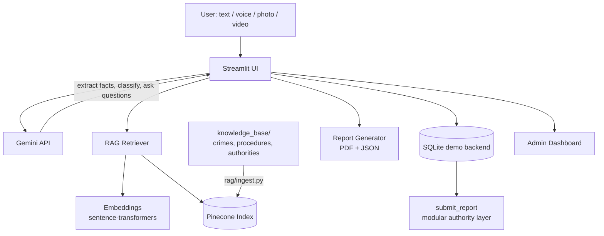

# 🛡️ Crime Report.AI

**Report what happened. Let AI guide the rest.**

An AI-powered, multimodal crime reporting assistant built as a hackathon MVP.
A person describes an incident — by typing, speaking, or uploading a
photo/video — and the app uses Google Gemini and a Retrieval-Augmented
Generation (RAG) pipeline over Pinecone to ask the right follow-up
questions, classify the incident, and produce a structured, downloadable
report ready for review and submission.

> ⚠️ **This is a hackathon prototype.** It is **not** connected to real
> emergency dispatch or any police department's systems. See
> [Disclaimer](#disclaimer).

---

## Problem

Reporting a crime or incident is often confusing and stressful for the
person affected. Victims frequently don't know what information is required,
what counts as useful evidence, or which authority to contact — and writing
a clear, structured account of what happened is hard to do in the moment,
especially on a phone.

## Solution

Crime Report.AI removes the burden of "writing a formal report." The user
just describes what happened in whatever form is easiest for them — voice,
text, a photo of the damage, a video clip — and the AI:

1. Understands and extracts structured facts from the description.
2. Classifies the incident into a standard category.
3. Retrieves relevant reporting guidance from a curated knowledge base (RAG).
4. Asks only the follow-up questions still needed — one at a time, with
   tap-friendly buttons — instead of a long fixed form.
5. Produces a clear summary, a reviewable report, and a downloadable PDF/JSON,
   then routes it to a demo backend with a tracking ID.

## Features

- 📝 Multimodal reporting — text, voice, photo, and video, combinable
- 🎙️ Voice input transcribed and editable before use
- 📷 Image evidence analysis (visible-only, never claims identity/intent)
- 🎥 Video evidence analysis with automatic frame-extraction fallback
- 🧭 AI crime classification into a controlled category set
- 📚 Real RAG pipeline (Pinecone + sentence-transformer embeddings)
- 💬 Dynamic AI questionnaire — no fixed script, stops once enough is known
- 📎 Evidence management, kept separate from AI-generated content
- 📄 PDF + structured JSON report generation
- 🏢 Modular "demo authority" submission layer with a tracking ID
- 📊 Admin/demo dashboard
- 📱 Mobile-friendly responsive UI (desktop, Android, iPhone, tablet)

## Architecture



**Request flow:** user input → Gemini (understanding, classification,
extraction) → RAG retrieval (Pinecone) informs the dynamic questionnaire →
Gemini generates the next question or declares completion → user reviews the
AI summary → confirms → PDF/JSON generated → submitted to the demo backend →
tracking ID returned.

## Tech Stack

| Layer | Technology |
|---|---|
| Frontend/UI | Streamlit (responsive, mobile-friendly) |
| Backend | Python 3.12 |
| LLM / multimodal AI | Google Gemini (`google-genai` SDK) **or** xAI Grok (OpenAI-compatible endpoint) — set via `LLM_PROVIDER` |
| Vector database | Pinecone (`pinecone` SDK v5+) |
| Embeddings | sentence-transformers (`all-MiniLM-L6-v2`), swappable for Gemini embeddings |
| Speech-to-text | faster-whisper (local, free, offline — independent of `LLM_PROVIDER`) |
| Document parsing | pypdf, python-docx |
| Report generation | reportlab (PDF), built-in `json` |
| Config | python-dotenv, environment variables |
| Database | SQLite (demo backend) |
| Video frame extraction | OpenCV (fallback path) |

### Swapping the LLM (section 36: everything is modular)

Every AI call in the app goes through [ai/llm.py](ai/llm.py), which picks a
backend based on `LLM_PROVIDER` in `.env`:

- `LLM_PROVIDER=gemini` (default) → [ai/gemini.py](ai/gemini.py), using the `google-genai` SDK.
- `LLM_PROVIDER=grok` → [ai/grok.py](ai/grok.py), using xAI's OpenAI-compatible `/v1/chat/completions` endpoint.

Grok's chat endpoint accepts text and images but not raw audio/video the way
Gemini does — video already falls back to frame extraction either way
(`input/video.py`), and voice transcription always runs locally via
faster-whisper (`input/voice.py`), so switching providers doesn't break
either feature.

## Project Structure

```
crime-report-ai/
├── app.py                  # Streamlit entry point / router
├── config/settings.py      # Env-driven configuration, categories, authorities
├── ai/                     # Gemini wrapper, classifier, question engine, vision, summarizer
├── rag/                    # Embeddings, Pinecone client, retriever, ingest.py
├── input/                  # text / voice / image / video input handlers
├── reports/generator.py    # PDF + JSON report generation
├── database/database.py    # Demo backend (SQLite) + submit_report()
├── ui/                     # One module per screen (home, report, questionnaire, ...)
├── knowledge_base/         # Source documents for the RAG index
└── tests/                  # Offline-safe unit tests
```

## Installation

```bash
git clone https://github.com/<your-username>/crime-report-ai.git
cd crime-report-ai
pip install -r requirements.txt
```

Copy the environment template and fill in your own keys:

```bash
cp .env.example .env
```

```text
LLM_PROVIDER=gemini                 # or "grok"
GEMINI_API_KEY=your-gemini-key      # https://aistudio.google.com/apikey
# GROK_API_KEY=your-grok-key        # https://console.x.ai (only if LLM_PROVIDER=grok)
PINECONE_API_KEY=your-pinecone-key  # https://app.pinecone.io
PINECONE_INDEX=crime-report-ai
```

**Never commit `.env`** — it's already in `.gitignore`.

### Build the knowledge base (one-time, or whenever documents change)

```bash
python -m rag.ingest
```

This reads everything under `knowledge_base/`, chunks it, embeds it, and
upserts it into your Pinecone index (created automatically if it doesn't
exist yet).

## Run

```bash
streamlit run app.py
```

Open the printed local URL — on a phone, use the same URL over your network
or your Streamlit Cloud deployment link. The UI adapts to phone/tablet/desktop
automatically.

### Demo scenario

Try pasting this into the text input to see the full flow:

> "I parked my car outside a shopping center around 9 PM. When I returned,
> the window was broken and my mobile phone and wallet were missing."

The app will classify it as a likely theft/property crime, pull relevant
reporting guidance via RAG, ask only the missing follow-up questions, and let
you attach evidence before generating the final report.

## Deployment (Streamlit Community Cloud)

1. Push this repository to GitHub (without `.env`).
2. On [share.streamlit.io](https://share.streamlit.io), create a new app
   pointing at `app.py` on your repo/branch.
3. In the app's **Settings → Secrets**, paste the contents of your `.env`
   (Streamlit Cloud reads `st.secrets`/env vars from there — see
   `config/settings.py`, which reads from `os.getenv`, so secrets set in the
   Cloud dashboard are picked up the same way as a local `.env`).
4. Deploy. Run `python -m rag.ingest` locally once beforehand (or via a
   one-off Cloud shell) so your Pinecone index is populated.

## Security & Privacy

- All secrets come from environment variables (`python-dotenv` locally,
  Streamlit Cloud secrets in production) — **never hard-coded**.
- `.env` is git-ignored; only `.env.example` (placeholders) is committed.
- Minimal data collection: only what's needed to file and follow up on a
  report. No passwords, banking details, or unnecessary identity data are
  ever requested.
- The user must explicitly review and confirm the report before submission.
- Original evidence files are never altered by AI — analysis is stored
  alongside, clearly labeled as AI-generated.
- AI output is never presented as legal advice or as proof a crime occurred.

## Disclaimer

Crime Report.AI provides AI-assisted reporting support. AI-generated
information may contain errors and should be reviewed by the user before
submission. The application does not replace emergency services, law
enforcement, legal professionals, or official reporting procedures. This
project is a hackathon prototype: no real government agency is integrated,
and "submission" in this app goes only to a demo backend for demonstration
purposes.
