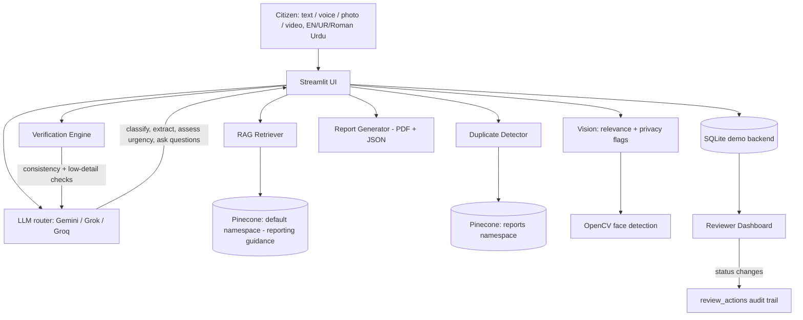

# 🛡️ Crime Report

**Report. Understand. Prioritize. Respond.**

An AI-powered civic safety platform prototype, built for the Pak Angels
hackathon. A citizen describes an incident — by typing, speaking, or
uploading a photo/video, in **English, Urdu, or Roman Urdu** — and the app
converts it into a structured, prioritized, privacy-aware case for an
**authorized reviewer** to triage: classified, urgency-scored, checked for
internal inconsistencies and duplicate/related reports, with sensitive
content in evidence photos flagged (not automatically redacted) for
awareness.

> ⚠️ **This is a hackathon prototype.** It does not determine guilt,
> innocence, or legal liability; it does not accuse anyone; it is not
> connected to real emergency dispatch or any police department's systems.
> See [Disclaimer](#disclaimer).

---

## Problem

Reporting an incident is often confusing and stressful for the person
affected — they may not know the right channel, struggle to describe what
happened in formal language, face a language barrier, or have no way to
track a complaint afterward. On the receiving side, unstructured reports
create manual work, duplicate cases, and make it hard to prioritize what's
actually urgent.

## Solution

Crime Report removes the burden of "writing a formal report" for the
citizen, and the burden of manually triaging unstructured submissions for
the reviewer:

1. Understands a free-form description — in English, Urdu, or Roman Urdu —
   and extracts structured facts.
2. Classifies the incident into a controlled category and assesses urgency
   (Critical/High/Medium/Low), always with an explainable reason.
3. Asks only the follow-up questions still needed, one at a time, in the
   reporter's chosen language — never a long fixed form.
4. Runs verification-support checks: internal consistency, low-detail
   reports, and duplicate/related-report detection — surfaced as neutral
   flags for a human reviewer, never as an accusation.
5. Checks evidence photos for relevance to the incident and flags (not
   auto-redacts) visible faces, ID documents, or phone numbers.
6. Produces a reviewable summary, a downloadable PDF/JSON, and a case ID,
   then hands it to an authorized reviewer's triage dashboard.

## Features

- 📝 Multimodal reporting — text, voice, photo, and video, combinable
- 🌐 English, Urdu, and Roman Urdu supported for intake and follow-up questions
- 🧭 AI classification into 13 incident categories, confirmed/overridden by
  the user's own category pick rather than trusted blindly
- 🚦 Explainable urgency/severity scoring (Critical/High/Medium/Low)
- 🔎 Verification-support engine: consistency/contradiction checks,
  low-detail flagging, and embedding-based duplicate/related-report detection
- 🔒 Evidence relevance + privacy detection (faces via local OpenCV,
  ID documents/phone numbers via vision LLM) — flags for the reviewer,
  never an identification
- 🕶️ Anonymous reporting supported end-to-end (data minimization)
- 🎙️ Voice input transcribed locally (faster-whisper) and editable
- 📄 PDF + structured JSON report generation
- 📊 Reviewer dashboard: filterable case queue, full case detail, status
  workflow (Submitted → Under Review → Assigned → Resolved/Closed), and an
  audited review-action log
- 📱 Mobile-friendly responsive UI (desktop, Android, iPhone, tablet)

## Architecture



**Request flow:** citizen input → LLM (understanding, classification,
urgency) → RAG retrieval informs the dynamic questionnaire → verification
engine checks consistency + flags low-detail reports → duplicate detector
compares against prior reports → citizen reviews the AI summary and flags →
confirms → PDF/JSON generated → lands in the reviewer dashboard's case queue
with a case ID.

## Tech Stack

| Layer | Technology |
|---|---|
| Frontend/UI | Streamlit (responsive, mobile-friendly) |
| Backend | Python 3.12 |
| LLM / multimodal AI | Google Gemini (`google-genai` SDK), xAI Grok, or Groq (both OpenAI-compatible) — set via `LLM_PROVIDER` |
| Vector database | Pinecone (`pinecone` SDK v5+) — reporting-guidance and duplicate-detection namespaces |
| Embeddings | sentence-transformers (`all-MiniLM-L6-v2`), swappable for Gemini embeddings |
| Speech-to-text | faster-whisper (local, free, offline — independent of `LLM_PROVIDER`) |
| Face detection | OpenCV Haar cascade (local, free, offline) |
| Document parsing | pypdf, python-docx |
| Report generation | reportlab (PDF), built-in `json` |
| Config | python-dotenv, environment variables |
| Database | SQLite (demo backend) |
| Video frame extraction | OpenCV (fallback path) |

### Swapping the LLM (everything is modular)

Every AI call goes through [ai/llm.py](ai/llm.py), which picks a backend
based on `LLM_PROVIDER` in `.env`:

- `LLM_PROVIDER=gemini` (default) → [ai/gemini.py](ai/gemini.py), using the `google-genai` SDK.
- `LLM_PROVIDER=grok` → [ai/grok.py](ai/grok.py), using xAI's OpenAI-compatible endpoint.
- `LLM_PROVIDER=groq` → [ai/groq.py](ai/groq.py), using Groq's OpenAI-compatible endpoint (fast inference of open models). Note: **Groq is a different company from Grok/xAI** despite the near-identical name — double-check which one you mean before grabbing a key.

None of these providers' chat endpoints accept raw audio/video the way
Gemini does — video falls back to frame extraction either way
(`input/video.py`), and voice transcription always runs locally via
faster-whisper (`input/voice.py`), so switching providers doesn't break
either feature.

## Project Structure

```
crime-report-ai/
├── app.py                     # Streamlit entry point / router (5-step reporting flow)
├── config/settings.py          # Categories, severity levels, required-fields checklist
├── ai/                          # llm.py router (gemini/grok/groq), classifier, question
│                                  engine, urgency.py, verification.py, duplicate_detector.py,
│                                  vision.py, summarizer.py
├── rag/                         # Embeddings, Pinecone client (namespace-aware), retriever, ingest.py
├── input/                       # text / voice / image / video input handlers
├── reports/generator.py         # PDF/JSON report generation
├── database/database.py         # Demo backend (SQLite): reports, related_incidents, review_actions
├── ui/                          # One module per screen — home, emergency, category_select, report,
│                                  questionnaire, evidence, review, submitted, my_reports, dashboard, about
├── knowledge_base/               # crimes/, procedures/ — general reporting-guidance RAG source docs
└── tests/                        # Offline-safe unit tests
```

## Installation

```bash
git clone https://github.com/<your-username>/crime-report-ai.git
cd crime-report-ai
pip install -r requirements.txt
```

Copy the environment template and fill in your own keys:

```bash
cp .env.example .env
```

```text
LLM_PROVIDER=gemini                 # or "grok" (xAI) or "groq" (Groq)
GEMINI_API_KEY=your-gemini-key      # https://aistudio.google.com/apikey
# GROK_API_KEY=your-grok-key        # https://console.x.ai (only if LLM_PROVIDER=grok)
# GROQ_API_KEY=your-groq-key        # https://console.groq.com (only if LLM_PROVIDER=groq)
PINECONE_API_KEY=your-pinecone-key  # https://app.pinecone.io
PINECONE_INDEX=crime-report-ai
```

**Never commit `.env`** — it's already in `.gitignore`.

### Build the knowledge base (one-time, or whenever documents change)

```bash
python -m rag.ingest
```

This ingests `knowledge_base/crimes/` and `knowledge_base/procedures/` into
Pinecone's default namespace (created automatically if it doesn't exist
yet). The duplicate-detection "reports" namespace is populated automatically
as reports are submitted — no manual step needed.

## Run

```bash
streamlit run app.py
```

Open the printed local URL — on a phone, use the same URL over your network
or your Streamlit Cloud deployment link. The UI adapts to phone/tablet/desktop
automatically.

### Demo scenario

Try this at the "Vehicle Theft" category, in Roman Urdu:

> "Meri bike kal market se chori ho gai thi. CCTV camera bhi laga hua hai."

The app will classify it as Vehicle Theft, assess a priority level with an
explanation, ask category-specific follow-ups **in Roman Urdu**, then on the
review screen show the AI summary, any verification flags, and possible
duplicate matches before you confirm and get a case ID. Open the Reviewer
Dashboard afterward to see the same case ready for triage.

## Deployment (Streamlit Community Cloud)

1. Push this repository to GitHub (without `.env`).
2. On [share.streamlit.io](https://share.streamlit.io), create a new app
   pointing at `app.py` on your repo/branch.
3. In the app's **Settings → Secrets**, paste the contents of your `.env`
   (Streamlit Cloud reads env vars from there — `config/settings.py` uses
   `os.getenv`, so Cloud secrets are picked up the same way as a local
   `.env`).
4. Deploy. Run `python -m rag.ingest` locally once beforehand (or via a
   one-off Cloud shell) so your Pinecone index is populated.

## Security & Privacy

- All secrets come from environment variables — **never hard-coded**.
  `.env` is git-ignored; only `.env.example` (placeholders) is committed.
- **Data minimization**: anonymous reporting is a first-class option — no
  name, phone, or email is required to submit a report.
- **No facial recognition or identification**: a detected face is a privacy
  flag for the reviewer's awareness, never an identification of a person.
- Original evidence files are never altered by AI — analysis (including
  privacy/relevance flags) is stored alongside, clearly labeled as
  AI-generated.
- Every reviewer status change is recorded in an audit trail
  (`review_actions` table) — who changed what, when, and why.
- Verification flags are always worded neutrally ("Needs Review",
  "Information Inconsistent") — never an accusation, and never a
  determination that a report is false.

## Disclaimer

Crime Report provides AI-assisted reporting support. AI-generated
classifications, priority levels, and verification flags may contain errors
and are reviewed by an authorized human reviewer before any action is
taken. The application does not replace emergency services or law
enforcement, and does not determine guilt, innocence, or legal liability.
This is a hackathon prototype: no real government agency, emergency
dispatch system, or facial-recognition/identification capability is
integrated — every "submission" goes only to a demo review queue.
