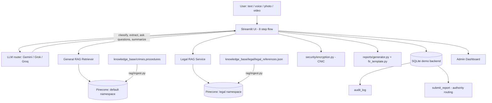

# 🛡️ Crime Report.AI

**Report what happened. Let AI guide the rest.**

An AI-powered assistant that walks someone through reporting an incident —
by typing, speaking, or uploading a photo/video — and produces a structured
**FIR (First Information Report) draft** referencing the relevant Pakistani
law (Pakistan Penal Code, PECA 2016, the Sindh Domestic Violence Act), ready
to review, confirm, and bring to a police station. Built around Google
Gemini / xAI Grok / Groq and a Retrieval-Augmented Generation (RAG) pipeline
over Pinecone.

> ⚠️ **This is a hackathon prototype, not a legal or government product.**
> It is **not** connected to real emergency dispatch, any police
> department's systems, or any e-FIR portal. Legal references shown in the
> app are drafted from public sources and have **not been verified by a
> lawyer** — see [Disclaimer](#disclaimer) and
> [docs/FIR_TECHNICAL_SPEC.md](docs/FIR_TECHNICAL_SPEC.md) for the full
> caveats.

---

## Problem

Filing an FIR is stressful and confusing, especially under pressure: victims
often don't know which category their incident falls under, what the police
will ask, which PPC/PECA section applies, or what a false-reporting warning
even means — and writing a clear, complete account in the moment (often on a
phone) is hard.

## Solution

Crime Report.AI turns that into a guided, 8-step conversation:

0. **Emergency check** — screens for "is this happening right now?" before
   anything else, surfacing a tap-to-call to the Police Helpline.
1. **Category** — the user picks the incident type first (tap, not typed).
2. **Multimodal intake** — text, voice (auto-transcribed), photo, or video,
   combinable.
3. **Dynamic questionnaire** — AI-driven, category-aware follow-up
   questions (what/when/where/who/suspect/witnesses/losses), never a fixed
   form, and it stops once it has enough.
4. **Legal reference lookup** — applicable PPC/PECA section(s),
   cognizable/bailable status, and punishment range, retrieved from a
   curated knowledge base (never guessed by the LLM).
5. **Review** — an editable, AI-generated summary of everything so far.
6. **False-reporting notice** — the PPC 182 penalty notice, with an explicit
   confirmation required before submission.
7. **Submission** — routed to a demo backend, with a tracking ID and a
   downloadable **FIR draft PDF** to bring to the station.

## Features

- 📝 Multimodal reporting — text, voice, photo, and video, combinable
- 🆘 Emergency screening before the flow starts, with tap-to-call
- 🧭 Category-first flow (8 Pakistan-relevant categories) with AI
  classification as a confirmation signal, never the primary driver
- 💬 Dynamic AI questionnaire, category-aware, no fixed script
- ⚖️ Legal reference lookup (PPC / PECA 2016 / Sindh Domestic Violence Act)
  via a dedicated RAG pipeline — grounded citations, not LLM recall
- ⚠️ False-reporting notice (PPC 182) with mandatory confirmation before
  submission
- 🔒 CNIC collected with field-level encryption at rest; masked in the UI,
  decrypted only on demand with an audit trail
- 🕵️ Audit log for every access to a sensitive-category report (Domestic
  Violence, Harassment)
- 📷 Image evidence analysis (visible-only, never claims identity/intent)
- 🎥 Video evidence analysis with automatic frame-extraction fallback
- 🎙️ Voice input transcribed locally (faster-whisper) and editable
- 📄 Formal **FIR draft PDF** + a general report PDF + structured JSON
- 🏢 Modular "demo authority" routing layer with a tracking ID
- 📊 Admin/demo dashboard
- 📱 Mobile-friendly responsive UI (desktop, Android, iPhone, tablet)

## Architecture



**Request flow:** emergency check → category (user-selected, canonical) →
multimodal intake → LLM classification (confirmation signal only) + general
RAG informs the dynamic questionnaire → legal RAG lookup (exact
category-filtered, never semantic-only) → review → false-reporting notice +
confirmation → submission (CNIC encrypted, FIR PDF generated, routed to a
demo authority) → tracking ID + downloadable FIR draft.

## Tech Stack

| Layer | Technology |
|---|---|
| Frontend/UI | Streamlit (responsive, mobile-friendly) |
| Backend | Python 3.12 |
| LLM / multimodal AI | Google Gemini (`google-genai` SDK), xAI Grok, or Groq (both OpenAI-compatible) — set via `LLM_PROVIDER` |
| Vector database | Pinecone (`pinecone` SDK v5+), two namespaces: general guidance + legal citations |
| Embeddings | sentence-transformers (`all-MiniLM-L6-v2`), swappable for Gemini embeddings |
| Speech-to-text | faster-whisper (local, free, offline — independent of `LLM_PROVIDER`) |
| Field-level encryption | `cryptography` (Fernet) — CNIC at rest |
| Document parsing | pypdf, python-docx |
| Report generation | reportlab (PDF), built-in `json` |
| Config | python-dotenv, environment variables |
| Database | SQLite (demo backend) |
| Video frame extraction | OpenCV (fallback path) |

### Swapping the LLM (everything is modular)

Every AI call goes through [ai/llm.py](ai/llm.py), which picks a backend
based on `LLM_PROVIDER` in `.env`:

- `LLM_PROVIDER=gemini` (default) → [ai/gemini.py](ai/gemini.py), using the `google-genai` SDK.
- `LLM_PROVIDER=grok` → [ai/grok.py](ai/grok.py), using xAI's OpenAI-compatible endpoint.
- `LLM_PROVIDER=groq` → [ai/groq.py](ai/groq.py), using Groq's OpenAI-compatible endpoint (fast inference of open models). Note: **Groq is a different company from Grok/xAI** despite the near-identical name — double-check which one you mean before grabbing a key.

None of these providers' chat endpoints accept raw audio/video the way
Gemini does — video falls back to frame extraction either way
(`input/video.py`), and voice transcription always runs locally via
faster-whisper (`input/voice.py`), so switching providers doesn't break
either feature.

## Project Structure

```
crime-report-ai/
├── app.py                       # Streamlit entry point / router (8-step flow)
├── config/settings.py           # Categories, required-fields checklist, authorities, keys
├── ai/                          # llm.py router (gemini/grok/groq), classifier, question
│                                   engine, vision, summarizer, legal_service.py
├── rag/                         # Embeddings, Pinecone client (namespace-aware),
│                                   retriever, ingest.py (general + legal)
├── security/encryption.py       # Fernet field-level encryption (CNIC)
├── input/                       # text / voice / image / video input handlers
├── reports/                     # generator.py (PDF/JSON) + fir_template.py (FIR draft)
├── database/database.py         # Demo backend (SQLite): reports, legal_references,
│                                   confirmations, fir_documents, audit_log
├── ui/                          # One module per screen — emergency_check, category_select,
│                                   report, questionnaire, legal_lookup, evidence, review,
│                                   false_reporting_notice, submitted, status, dashboard, about
├── knowledge_base/              # crimes/, procedures/ (general RAG) + legal/ (statute RAG)
├── docs/FIR_TECHNICAL_SPEC.md   # Full data model / screen flow / service-layer spec
└── tests/                       # Offline-safe unit tests
```

## Installation

```bash
git clone https://github.com/<your-username>/crime-report-ai.git
cd crime-report-ai
pip install -r requirements.txt
```

Copy the environment template and fill in your own keys:

```bash
cp .env.example .env
```

```text
LLM_PROVIDER=gemini                 # or "grok" (xAI) or "groq" (Groq)
GEMINI_API_KEY=your-gemini-key      # https://aistudio.google.com/apikey
# GROK_API_KEY=your-grok-key        # https://console.x.ai (only if LLM_PROVIDER=grok)
# GROQ_API_KEY=your-groq-key        # https://console.groq.com (only if LLM_PROVIDER=groq)
PINECONE_API_KEY=your-pinecone-key  # https://app.pinecone.io
PINECONE_INDEX=crime-report-ai
FIELD_ENCRYPTION_KEY=               # generate below — required for CNIC handling
```

Generate the encryption key (do this once, keep it secret and stable —
rotating it makes previously-stored CNICs undecryptable):

```bash
python -c "from cryptography.fernet import Fernet; print(Fernet.generate_key().decode())"
```

**Never commit `.env`** — it's already in `.gitignore`.

### Build the knowledge base (one-time, or whenever documents change)

```bash
python -m rag.ingest
```

This ingests both the general reporting-guidance documents
(`knowledge_base/crimes/`, `knowledge_base/procedures/`) into Pinecone's
default namespace, and the structured legal citations
(`knowledge_base/legal/legal_references.json`) into a separate `legal`
namespace, so a legal-reference lookup can never surface general guidance
text instead of an actual statute.

## Run

```bash
streamlit run app.py
```

Open the printed local URL — on a phone, use the same URL over your network
or your Streamlit Cloud deployment link. The UI adapts to phone/tablet/desktop
automatically.

### Demo scenario

Try this at Step 2 (after picking "Vehicle Theft") to see the full flow:

> "My motorcycle was stolen from outside my house last night. It was
> parked and locked."

The app will confirm the category, ask category-specific follow-ups
(registration number, color, witnesses...), show you the applicable PPC
theft sections at Step 4, walk you through the false-reporting notice, and
generate a downloadable FIR draft referencing those exact sections.

## Deployment (Streamlit Community Cloud)

1. Push this repository to GitHub (without `.env`).
2. On [share.streamlit.io](https://share.streamlit.io), create a new app
   pointing at `app.py` on your repo/branch.
3. In the app's **Settings → Secrets**, paste the contents of your `.env`
   (Streamlit Cloud reads env vars from there — `config/settings.py` uses
   `os.getenv`, so Cloud secrets are picked up the same way as a local
   `.env`).
4. Deploy. Run `python -m rag.ingest` locally once beforehand (or via a
   one-off Cloud shell) so your Pinecone index is populated.

## Security & Privacy

- All secrets come from environment variables — **never hard-coded**.
  `.env` is git-ignored; only `.env.example` (placeholders) is committed.
- **CNIC is field-level encrypted** (Fernet) before it ever reaches the
  database — the plaintext value is stripped out before the rest of the
  reporter record is stored, and only `decrypt_cnic()` can reveal it, which
  always writes an audit log entry.
- **Sensitive categories** (Domestic Violence, Harassment) go through an
  audited read path — every access is logged with an actor, timestamp, and
  category.
- Minimal data collection: only what's needed to file and follow up on a
  report. No passwords or banking details are ever requested.
- The user must explicitly review, see the false-reporting notice, and
  confirm before submission — two separately timestamped confirmations.
- Original evidence files are never altered by AI — analysis is stored
  alongside, clearly labeled as AI-generated.
- Legal references are retrieved from a curated knowledge base via exact
  category-filtered RAG — **never generated from an LLM's memory** — to
  avoid a model confidently stating the wrong statute number.

## Disclaimer

Crime Report.AI provides AI-assisted reporting support. AI-generated
information — including summaries, classifications, and legal references —
may contain errors and must be reviewed by the user before submission. It
does **not** replace emergency services, law enforcement, or a qualified
lawyer, and nothing it produces is legal advice. This is a hackathon
prototype: no real government agency, e-FIR system, or emergency dispatch
service is integrated — every "submission" goes only to a demo backend, and
every generated FIR is a **draft** the user must bring to a real police
station themselves. Legal citations (PPC/PECA/Sindh Domestic Violence Act
sections, cognizable/bailable status, punishment ranges) are drafted from
publicly available sources and **have not been verified by a lawyer** — see
[docs/FIR_TECHNICAL_SPEC.md](docs/FIR_TECHNICAL_SPEC.md) §3.2 for sourcing
details before relying on any of them.
